# Tableau-A-Z
Udemy's Tableau A-Z: Hands-On Tableau Training For Data Science! Learn data visualization through Tableau and create opportunities for you or key decision makers to discover data patterns such as customer purchase behavior, sales trends, or production bottlenecks.

Concepts learned:
1) Install Tableau Desktop
2) Connect Tableau to various Datasets: Excel and CSV files
3) Create Barcharts
4) Create Area Charts
5) Create Maps
6) Create Scatterplots
7) Create Piecharts
8) Create Treemaps
9) Create Interactive Dashboards
10) Create Storylines
11) Understand Types of Joins and how they work
12) Work with Data Blending in Tableau
13) Create Table Calculations
14) Work with Parameters
15) Create Dual Axis Charts
16) Create Calculated Fields
17) Create Calculated Fields in a Blend
18) Export Results from Tableau into Powerpoint, Word, and other software
19) Work with Timeseries Data (two methods)
20) Creating Data Extracts in Tableau
21) Understand Aggregation, Granularity, and Level of Detail
22) Adding Filters and Quick Filters
23) Create Data Hierarchies
24) Adding Actions to Dashboards (filters & highlighting)
25) Assigning Geographical Roles to Data Elements
26) Advanced Data Preparation

References:  
https://www.tableau.com  
https://public.tableau.com  
https://www.udemy.com/tableau10  
https://www.superdatascience.com/tableau  

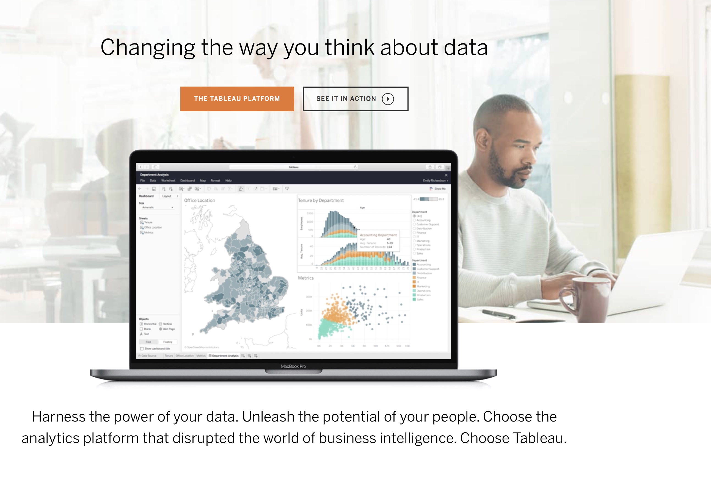

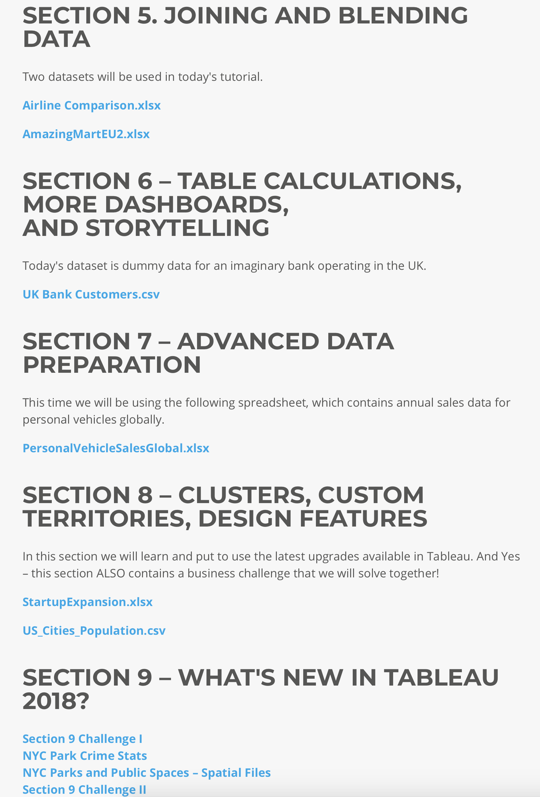

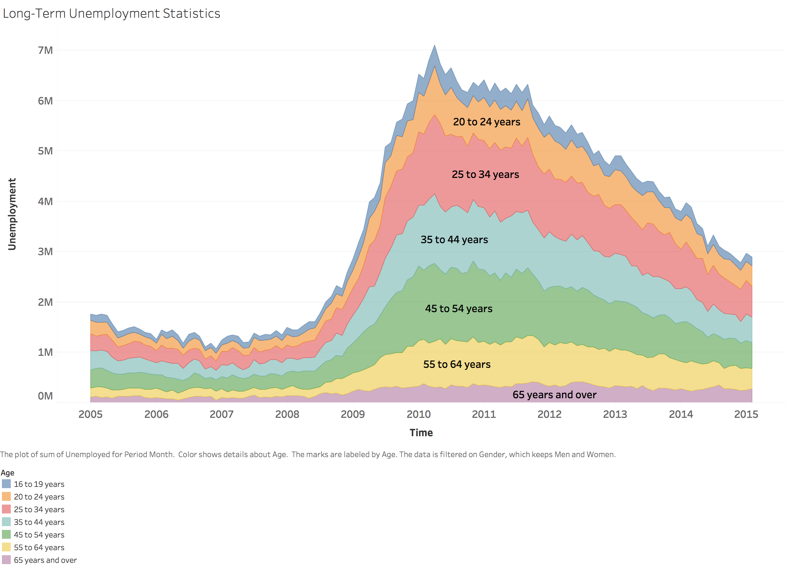

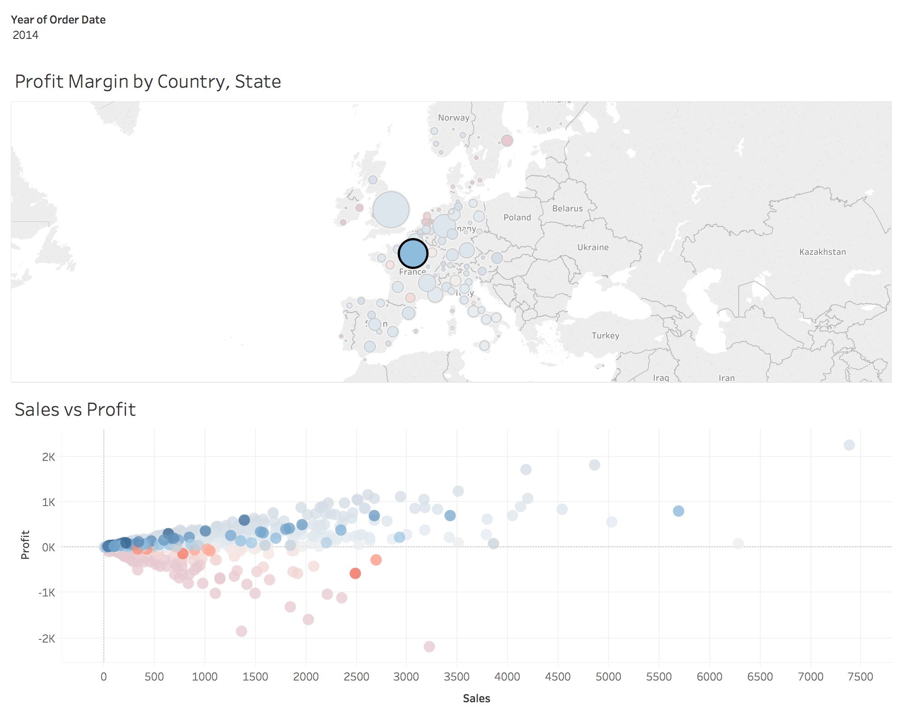

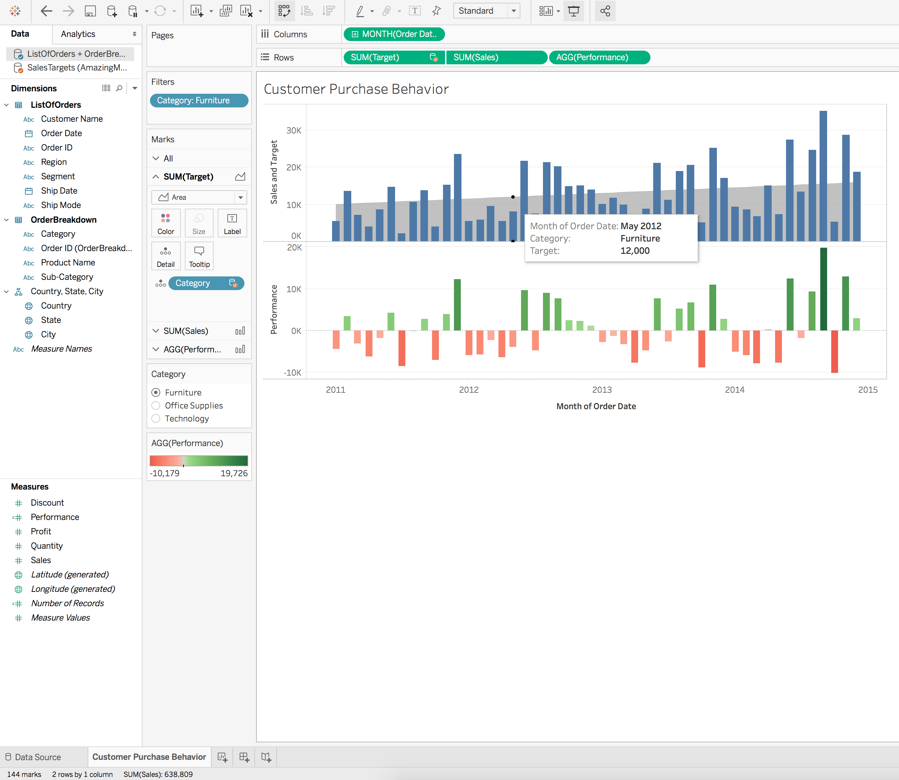

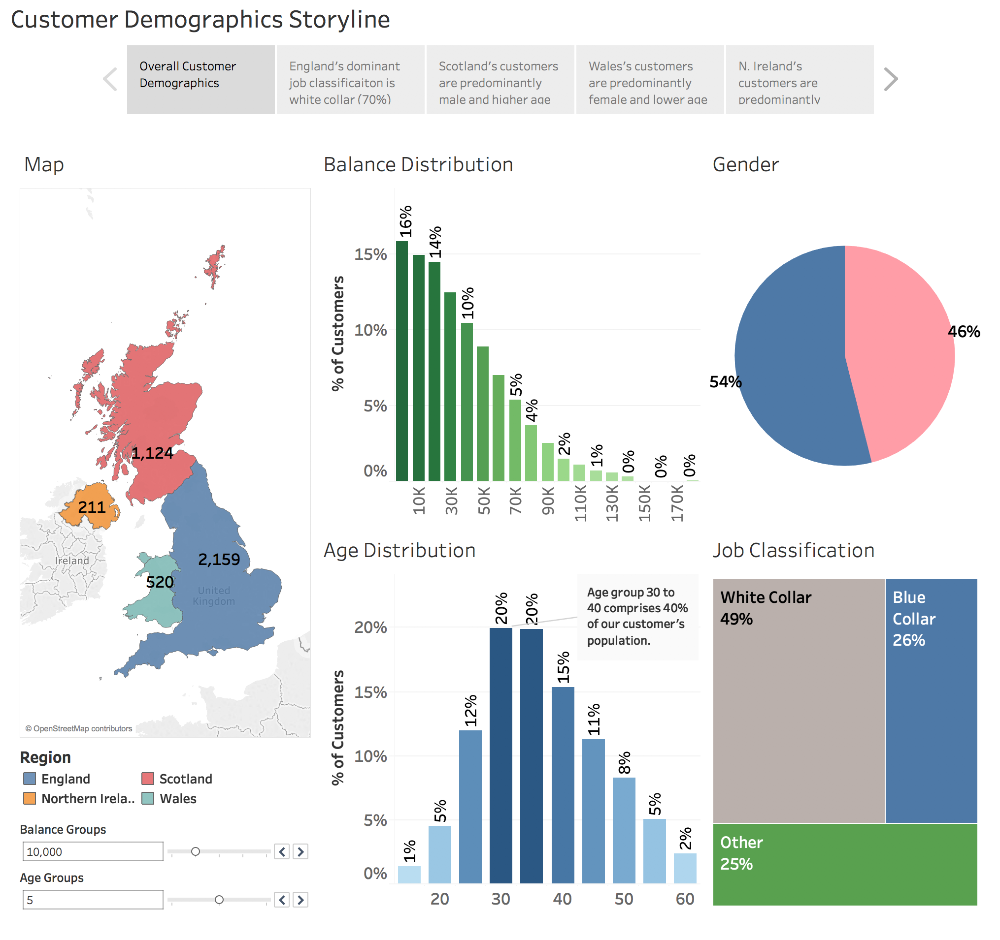

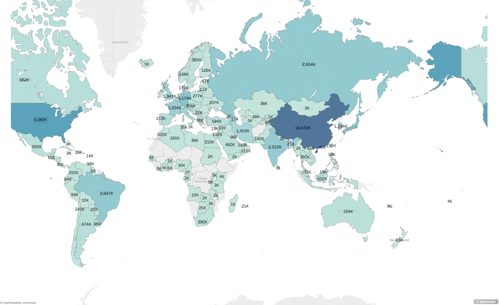

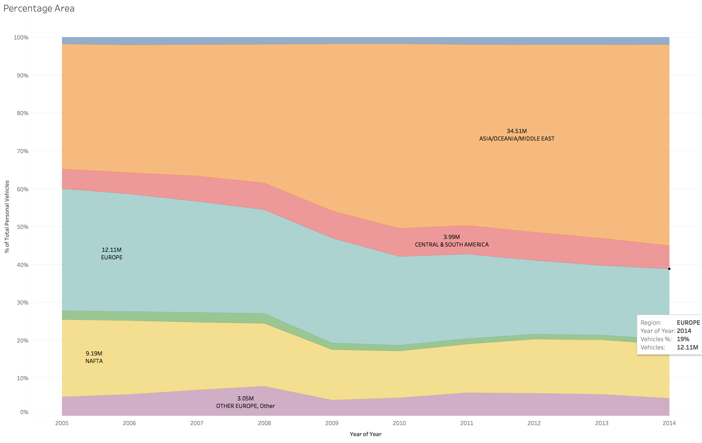

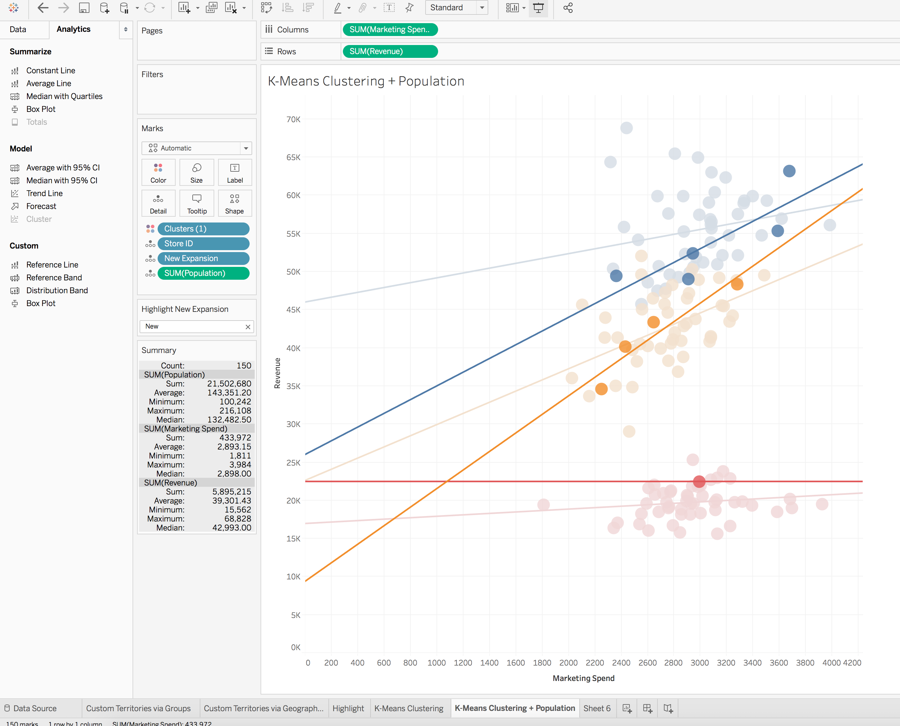

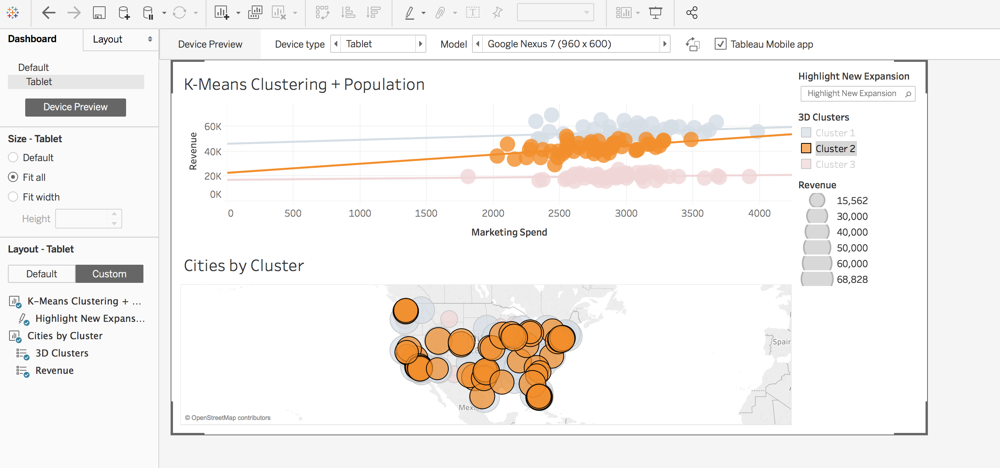

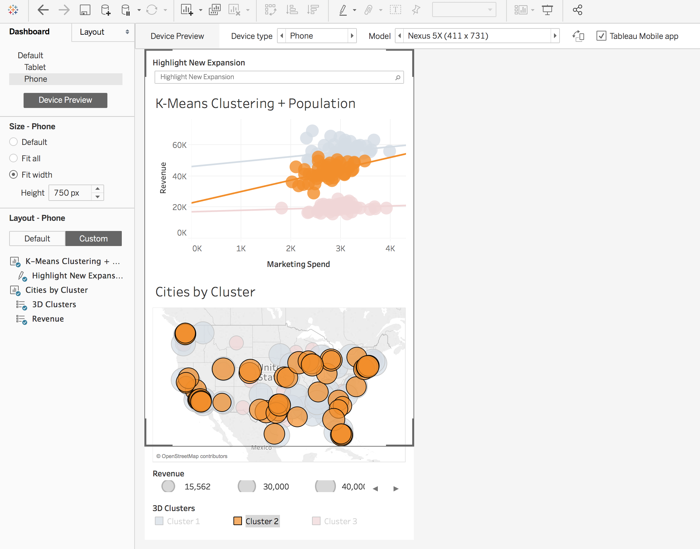

